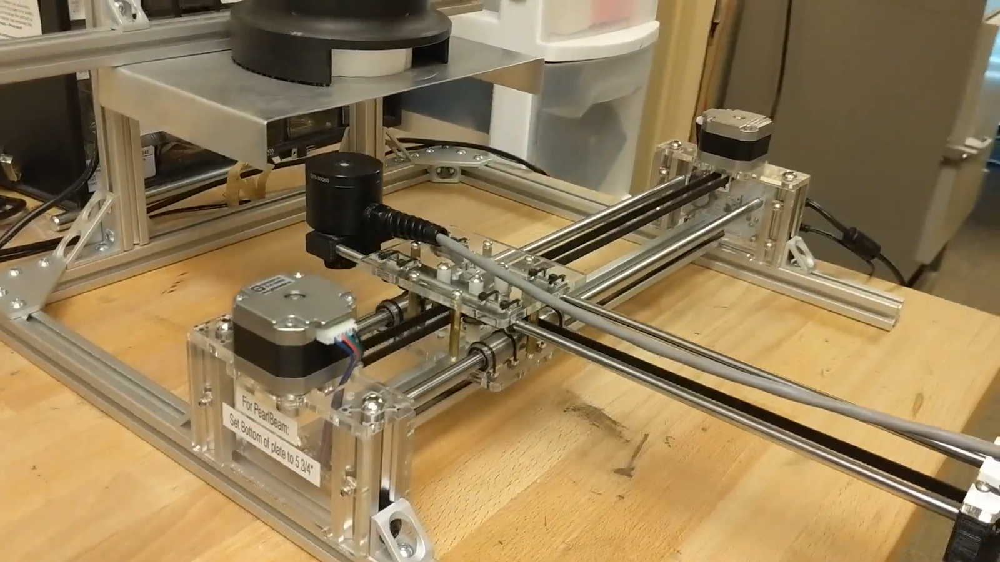
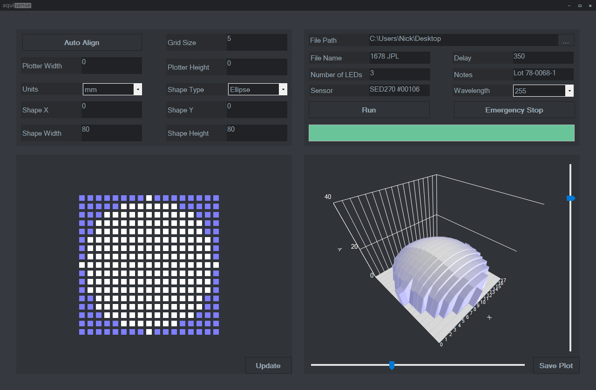
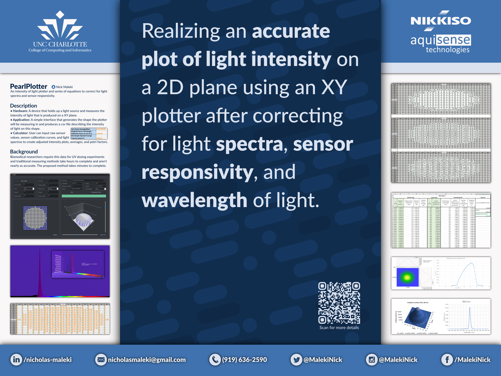
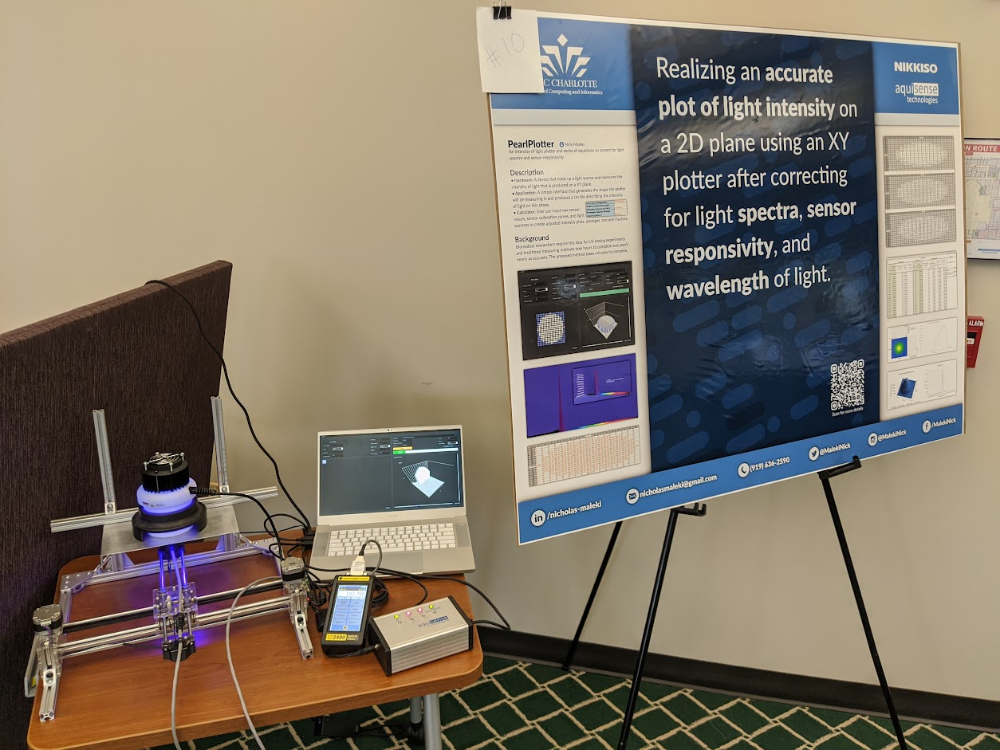
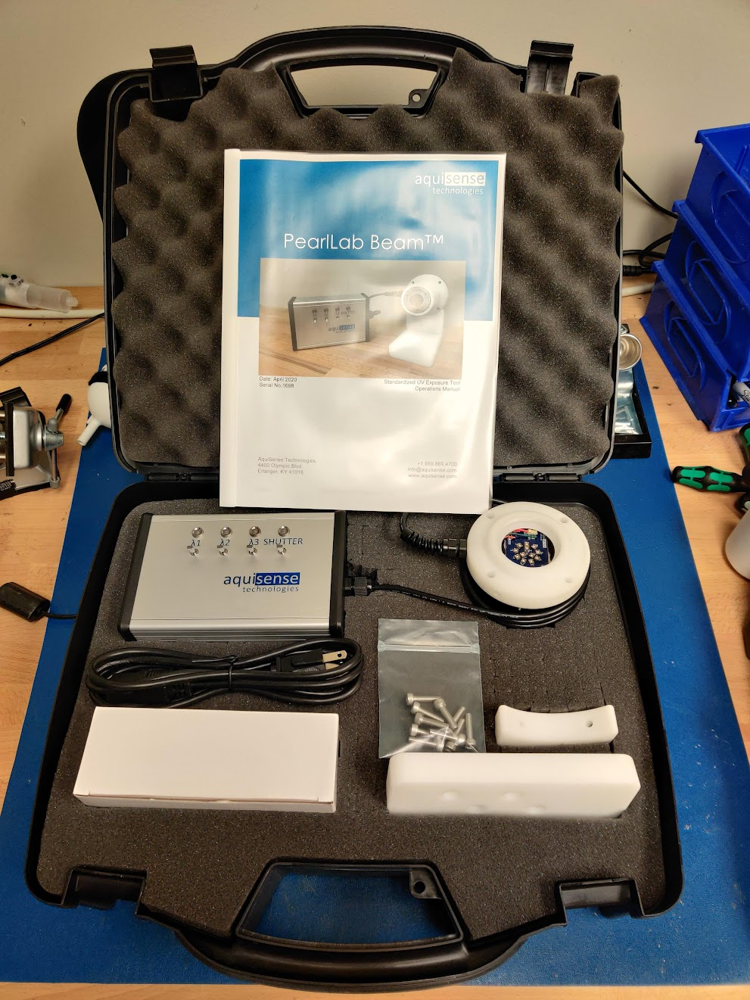
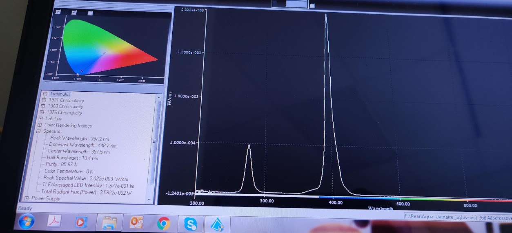

# Pearl Plotter
An intensity of light plotter that holds up a light source and measures the intensity of light that is produced on an XY plane. 

### The device I made

### The application I built

### A poster I made describing more details about the plotter

### Bioreactors that were measured on this device

A spectra of one of the PearlBeams taken on an integrating sphere
